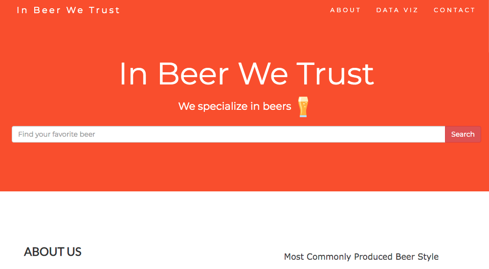
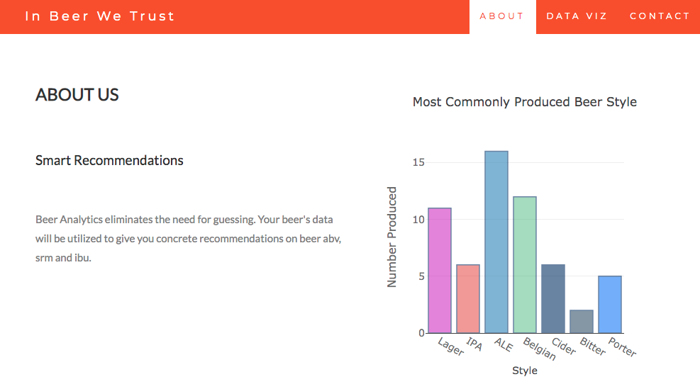
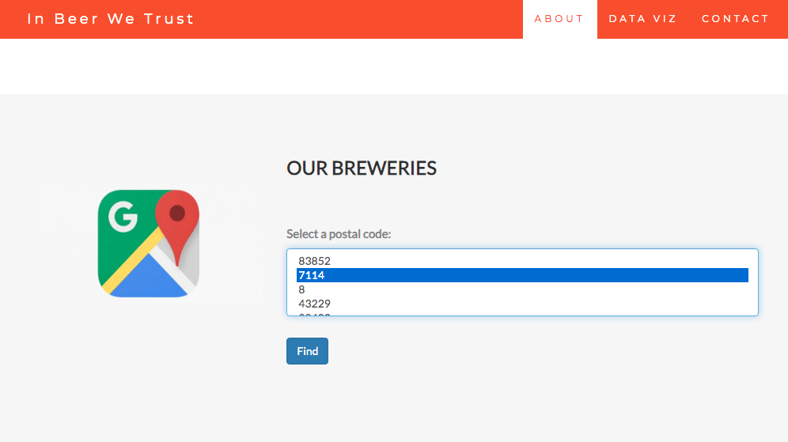
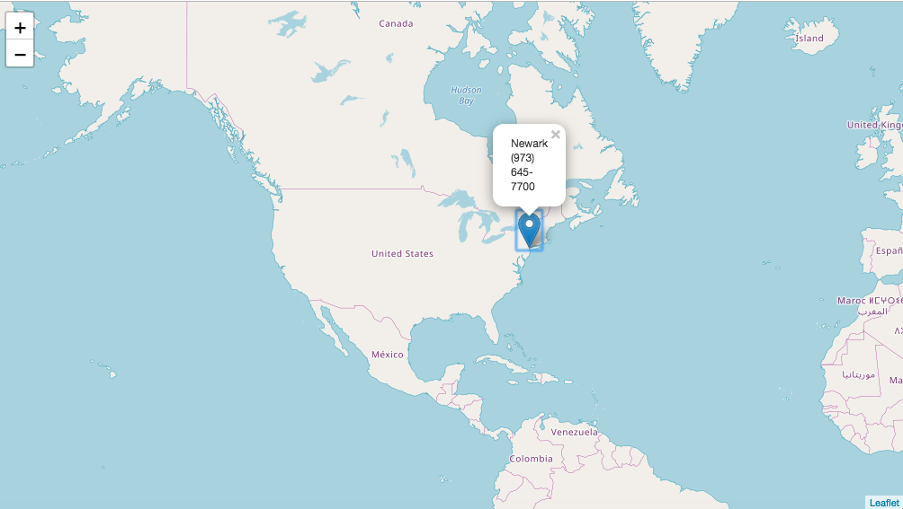
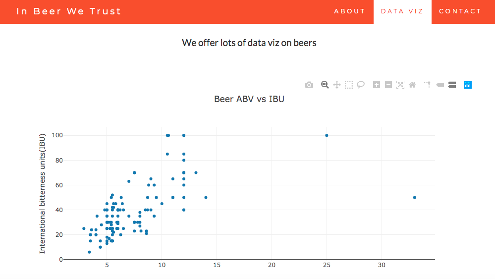
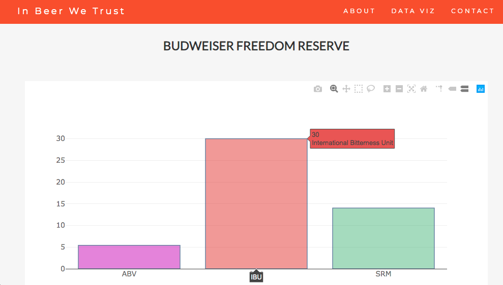

# Project_Beer
Project beer is a simple flask web application in which different informations on beer and its breweries are displayed. 
Data on beer is extracted from BreweryDB API(https://www.brewerydb.com/developers/docs) and then cleaned and integrated into postgresql. Python libraries such as plotly and folium are used for data visualization. 

# Installation 

Use the package manager [pip](https://pip.pypa.io/en/stable/) to install library.

```bash
pip install flask
pip install folium
pip install plotly
pip install psycopg2 

```

# How to run the app  


```runapp

export FLASK_APP=run.py 
python -m flask run 

OR

Run the run.py script on your browser, open the URL localhost: 5000


```

# Screenshots for the final result 

Image_1



Image_2 



Image_3 



Image_4 




Image_5 




Image_6 




